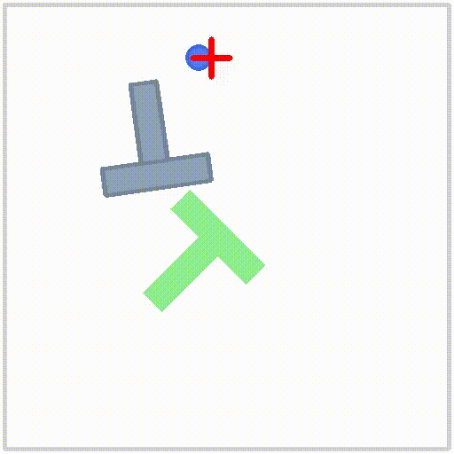

# Policy Benchmarks

<p align="center">
  
  
  
  
  
  
 </p>

## Introduction

This codebase provides EBT Policy for running the benchmarks used in the paper.
This project is forked from the [Robomimic](https://github.com/ARISE-Initiative/robomimic) project,
with additions including transformer-based Diffusion Policy, the PushT benchmark and a lightweight EBT Policy.
The larger, multi-task, language-conditioned EBT Policy used for real world deployment is not provided in this code.

[**[Homepage]**](https://robomimic.github.io/) &ensp; [**[Documentation]**](https://robomimic.github.io/docs/introduction/overview.html) &ensp; [**[Study Paper]**](https://arxiv.org/abs/2108.03298) &ensp; [**[Study Website]**](https://robomimic.github.io/study/) &ensp; [**[ARISE Initiative]**](https://github.com/ARISE-Initiative)

## Installation

1. Create conda environment
```
conda create -n ebt_policy python=3.8.0
conda activate ebt_policy
```

2. Intall pytorch
```
conda install pytorch==2.0.0 torchvision==0.15.0 -c pytorch
```

3. Install project
```
# Install simulator
git clone https://github.com/ARISE-Initiative/robosuite.git
cd robosuite
pip install -r requirements.txt
cd ..

# Install project
git clone https://github.com/ZhiChengAIR/benchmarks.git
cd benchmarks
pip install -e .
```

## Reproducing Robomimic Benchmarks
For downloading the robomimic datasets, please visit the [documentation](https://robomimic.github.io/docs/introduction/getting_started.html).

To train EBT Policy on a robomimic dataset, you can run the below command. Configurations can be altered [here](https://github.com/ZhiChengAIR/ebt_policy_benchmarks/blob/master/robomimic/exps/templates/ebt_policy.json).

```
python robomimic/scripts/train.py --config robomimic/exps/templates/ebt_policy.json --dataset /path/to/dataset.hdf5
```

## Reproducing PushT Benchmark
For downloading PushT, run the following command:
```
wget https://diffusion-policy.cs.columbia.edu/data/training/pusht.zip
unzip pusht.zip && rm -f pusht.zip
python robomimic/scripts/conversion/convert_pusht_dataset_to_hdf5.py -i pusht.zarr -o /path/to/dataset.hdf5
```

To train EBT Policy on the PushT dataset, you can run the below command. Configurations can be altered [here](https://github.com/ZhiChengAIR/ebt_policy_benchmarks/blob/master/robomimic/exps/templates/ebt_policy_pusht.json).
```
python robomimic/scripts/train.py --config robomimic/exps/templates/ebt_policy_pusht.json --dataset /path/to/dataset.hdf5
```

## Docker

You can use the `Dockerfile` to easily build a containerized environment for setting up robomimic with Python 3.9, Miniconda, robosuite, and PyTorch (CPU/GPU support).

To build, run:
`docker build -t robomimic .`

To run without GPU (CPU only), run:
`docker run -it robomimic`

To run with GPU (if available), run:
`docker run --gpus all -it robomimic`

## Troubleshooting

Please see the [troubleshooting](https://robomimic.github.io/docs/miscellaneous/troubleshooting.html) section for common fixes, or [submit an issue](https://github.com/ARISE-Initiative/robomimic/issues) on our github page.

## Contributing to robomimic
This project is part of the broader [Advancing Robot Intelligence through Simulated Environments (ARISE) Initiative](https://github.com/ARISE-Initiative), with the aim of lowering the barriers of entry for cutting-edge research at the intersection of AI and Robotics.
The project originally began development in late 2018 by researchers in the [Stanford Vision and Learning Lab](http://svl.stanford.edu/) (SVL).
Now it is actively maintained and used for robotics research projects across multiple labs.
We welcome community contributions to this project.
For details please check our [contributing guidelines](https://robomimic.github.io/docs/miscellaneous/contributing.html).

## Citation

Please cite [this paper](https://arxiv.org/abs/2108.03298) if you use this framework in your work:

```bibtex
@inproceedings{robomimic2021,
  title={What Matters in Learning from Offline Human Demonstrations for Robot Manipulation},
  author={Ajay Mandlekar and Danfei Xu and Josiah Wong and Soroush Nasiriany and Chen Wang and Rohun Kulkarni and Li Fei-Fei and Silvio Savarese and Yuke Zhu and Roberto Mart\'{i}n-Mart\'{i}n},
  booktitle={Conference on Robot Learning (CoRL)},
  year={2021}
}
```
